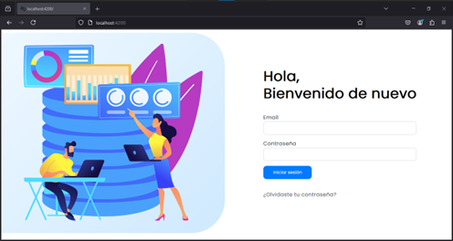
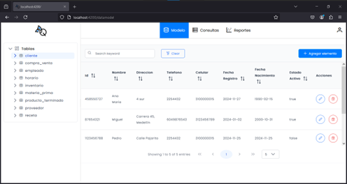
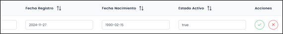
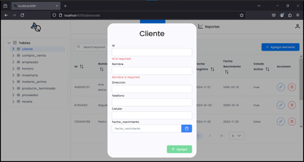
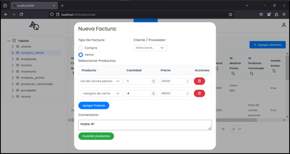
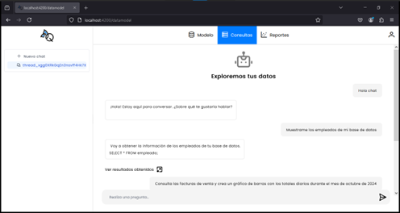
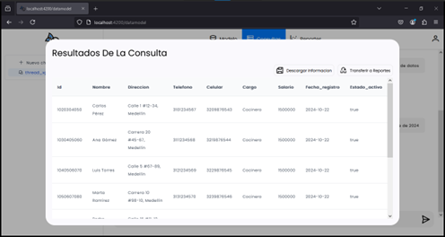
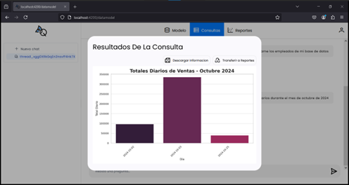
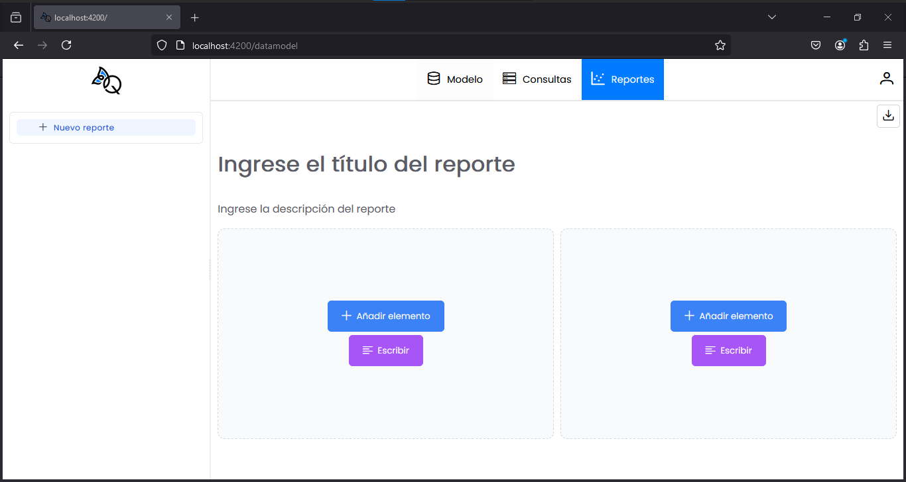
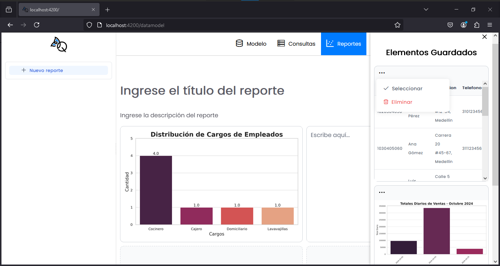

# AI-Base

AI-Base es una plantilla de código abierto diseñada para tareas de análisis y gestión de bases de datos. Proporciona un pipeline completo para gestionar, consultar y visualizar datos de manera eficiente. Esta solución es adaptable y extensible, ideal para empresas que desean integrar herramientas de inserción, modificación y análisis de datos de manera sencilla.


## Características Clave

- **Gestión de Bases de Datos**: Integra una base de datos SQL a nuestra interfaz y permite crear, editar y eliminar registros fácilmente.
- **Consultas Personalizadas**: Genera consultas a tu base de datos con asistentes de IA.
- **Exportación de Datos**: Descarga información en formatos accesibles.
- **Visualización Avanzada**: Genera gráficos estadísticos personalizados.
- **Asistencia por IA**: Usa lenguaje natural para facilitar las tareas.
- **Gestión de sesiones**: Brinda acceso a diferentes administradores para hacer modificaciones, consultar y reportar información.

---

## Requerimientos del Sistema

- **Sistemas Operativos**: Compatible con Windows y macOS.
- **Navegadores Web**: Google Chrome, Firefox, Microsoft Edge.
- **Tecnologías**:
  - Angular, Python y PostgreSQL.
  - Node.js y npm para el front-end.
  - Python y librerías requeridas para el back-end.


## Requerimientos Previos

- Instalar Visual Studio Code
- Instalar Node.js
- Instalar git

## Instalación

AI-Base está compuesto por dos repositorios: uno para el back-end y otro para el front-end. Sigue los pasos a continuación para instalar y ejecutar la aplicación en tu entorno local.

### Clonar Repositorios

Utilice la terminal de git para ejecutar la siguiente instrucción:

```bash
# Clonar el repositorio del proyecto AI-Base
git clone https://github.com/JEROLPOA2/AI-Base.git
```

### Configuración del Back-end

A traves de Visual Studio Code ingrese a la carpeta del repositorio y ejecute las siguientes instrucciones en una terminal de git:

```bash
cd Back-End
pip install -r requirements.txt
```

### Configuración del Front-end

A traves de Visual Studio Code ingrese a la carpeta del repositorio y ejecute las siguientes instrucciones en una terminal de git:

```bash
cd Front-End
npm install
```

**Nota**: Asegúrate haber instalado [Node.js](https://nodejs.org/en/) y npm previamente.


## Ejecución

### Servidor del Front-end

A traves de Visual Studio Code ingrese a la carpeta del repositorio y ejecute las siguientes instrucciones en una terminal de git:

```bash
cd Front-End
ng serve -o
```

### Servidor del Back-end

A traves de Visual Studio Code ingrese a la carpeta del repositorio y ejecute las siguientes instrucciones en una terminal de git:

```bash
cd Back-End
```

A traves de Visual Studio Code cree una terminal de PowerShell y ejecute la siguiente instrucción:

```bash
uvicorn app.main:app --reload --port 4321
```


**Nota**: Por defecto la aplicación debe configurarse para correr en el puerto 4321, en caso de que se requiera utilizar un puerto diferente asegurese de corregir debidamente las rutas tanto en Back-End como en Front-End.


## Configuración De Servicios Externos

Debido a que este proyecto está diseñado como una plantilla personalizable, los servicios de Bases De Datos, Asistencia De Inteligencia Artificial y Gestión De Sesiones no están incluidos. Estos deben ser adquiridos de forma independiente y deben ser configurados como se muestra a continuación:

### Base de Datos
1. Utilice su entorno local o servicios en la nube para diseñar y configurar su base de datos

2. Cree un archivo `.env` dentro de la carpeta Back-End con las siguientes variables y configurelas con la información de acceso a su base de datos:

```
HOST=database-host
PORT=connection-port
DB_USER=database-user
DB_PASSWORD=database-password
DATABASE=database
```

3. Dentro del Back-End revise y adapte las funciones dependientes del esquema de la base de datos, estas pueden encontrarse en las carpetas `db`, `controllers`, `services`, `repository`, y `models`.

4. Ajuste los endpoints del Front-End para que coincidan con aquellos definidos en el Back-End.


### Asistencia por IA

AI-Base utiliza 4 asistentes de OpenAI que se comunican entre sí para gestionar diferentes funcionalidades:

**Intention Assistant**: Detecta la intención del usuario y conmuta las solicitudes a los asistentes correspondientes.
**Chat Assistant**: Responde preguntas generales.
**Database Query Assistant**: Genera consultas SQL basadas en el esquema de la base de datos.
**Plot Assistant**: Crea gráficos estadísticos basados en los datos consultados.

En caso de utilizar el servicio de OpenAI para la Asistencia De Inteligencia Artificial.

1. Acceda a su Playground en https://platform.openai.com y cree los 4 asistentes correspondientes.

2. Configure las **System Instructions** de sus asistentes haciendo uso de la información del archivo **Assistants System Instructions** presente en el repositorio.

3. Para el Database **Query Assistant**, asegúrese de proporcionarle un dump del esquema de la base de datos, se recomienda también proporcionarle un documento explicativo de relacione la base de datos con la realidad y las necesidades del negocio.

4. Habilite en el **Plot Assistant** la funcionalidad de Code Interpreter.

5. Se recomienda configurar los parametros **Temprerature** y **Top P** de cada asistente a valores dentro del rango (0.01, 0.2) con el objetivo de obtener respuestas concisas y evitar que los modelos "inventen información".

6. Agregue las siguientes variables en el archivo `.env` del back-end y configurelas con los ID correspondientes:

```bash
INTENTION_ASSISTANT = your-intention-assistant-id
DATABASE_ASSISTANT = your-database-assistant-id
GRAPH_ASSISTANT = your-graph-assistant-id
CHAT_ASSISTANT = your-chat-assistant-id
```

### Gestión De Sesiones

AI-Base utiliza los servicios de [Firebase](https://firebase.google.com/) para realizar la gestión de sesiones.
Siga los pasos siguientes para configurar el servicio de gestión de sesiones:

1. Cree y configure un proyecto de Firebase.
2. Dentro de la de Front-End/src cree el archivo **enviroment.ts**.
3. Agregue las siguientes variables de entorno al archivo y configurelas con los datos proporcionados por Firebase:

```bash
export const environment = {
    apiKey: your-apiKey,
    authDomain: your-authDomain,
    projectId: your-projectId,
    storageBucket: syour-torageBucket,
    messagingSenderId: your-messagingSenderId,
    appId: your-appId,
    measurementId: your-measurementId,
  };
```

## Manual de Usuario

### Página de Bienvenida



Permite a los usuarios autenticarse con su correo electrónico y contraseña.

### Modelo de Datos




Administra las tablas de la base de datos:
- Navegación por tablas en la barra lateral.
- Edición y visualización de registros en una tabla dinámica.

### Formulario de Inserción de Datos




Permite ingresar nuevos registros a la tabla seleccionada.

### Sección de Consultas



Interactúa con un asistente de IA para extraer y visualizar información.

### Ventana Emergente de Resultados




Muestra tablas de datos y gráficos generados por el asistente, con opciones para:
- Descargar la información.
- Transferir la información a la sección de reportes.

### Sección de reportes (En desarrollo)




- Permite crear dashboards con la información consultada y guardarlos como imagen.


¡Gracias por usar AI-Base! 🎉
